# JobPulse™ — Complete Application Documentation

**Last Updated:** February 14, 2026
**Version:** 3.3
**Production URL:** [jobpulse.lyntrix.ai](https://jobpulse.lyntrix.ai)
**Repository:** [KyleRoots/JobPulse](https://github.com/KyleRoots/JobPulse)

---

## Table of Contents

1. [Platform Overview](#1-platform-overview)
2. [System Architecture](#2-system-architecture)
3. [Application Entry Point & Startup](#3-application-entry-point--startup)
4. [Perpetual Freshness Engine](#4-perpetual-freshness-engine)
5. [AI Candidate Vetting System](#5-ai-candidate-vetting-system)
6. [Embedding Pre-Filter (Layer 1)](#6-embedding-pre-filter-layer-1)
7. [Multi-Model Scoring (Layers 2 & 3)](#7-multi-model-scoring-layers-2--3)
8. [Resume Processing Pipeline](#8-resume-processing-pipeline)
9. [Vetting Notifications & Bullhorn Notes](#9-vetting-notifications--bullhorn-notes)
10. [Job Requirements Management](#10-job-requirements-management)
11. [Inbound Email Parsing](#11-inbound-email-parsing)
12. [Job Application Portals](#12-job-application-portals)
13. [XML Feed Generation & SFTP Distribution](#13-xml-feed-generation--sftp-distribution)
14. [Bullhorn ATS Integration](#14-bullhorn-ats-integration)
15. [Email & Notification System](#15-email--notification-system)
16. [Monitoring & Operations](#16-monitoring--operations)
17. [Cron Jobs & Scheduled Tasks](#17-cron-jobs--scheduled-tasks)
18. [Database Schema](#18-database-schema)
19. [Routes & UI Pages](#19-routes--ui-pages)
20. [API Endpoints Reference](#20-api-endpoints-reference)
21. [Testing](#21-testing)
22. [Infrastructure & Deployment](#22-infrastructure--deployment)
23. [Configuration Reference](#23-configuration-reference)
24. [Security](#24-security)
25. [Job Classification Engine](#25-job-classification-engine)
26. [Incident History & Fixes](#26-incident-history--fixes)
27. [File Structure Reference](#27-file-structure-reference)

---

## 1. Platform Overview

**JobPulse™** is an intelligent job visibility and candidate vetting automation platform built for staffing agencies. It connects Bullhorn ATS/CRM to job board distribution networks, ensuring job listings stay visible indefinitely through automated refresh cycles, while simultaneously providing AI-powered candidate vetting for inbound applicants.

### Core Value Propositions

| Capability | Impact |
|---|---|
| **Perpetual Job Freshness** | Maintains 100% visibility vs. 15% decay at Day 30 |
| **AI Candidate Vetting** | Automatically screens 100% of inbound applicants against all open positions |
| **Zero Manual Intervention** | Eliminates 40+ hours/month of manual refresh and screening work |
| **Cost-Optimized AI** | 3-layer architecture reduces GPT-4o API costs via embedding pre-filtering |

### Current Deployment

| Property | Value |
|---|---|
| **Production URL** | `jobpulse.lyntrix.ai` |
| **Application Portals** | `apply.myticas.com`, `apply.stsigroup.com` |
| **Active Job Postings** | 58+ managed positions across 4 tearsheets |
| **Refresh Frequency** | Every 30 minutes (XML feed), every 5 minutes (vetting cycle) |
| **Uptime** | 99.95% (30-day average) |
| **Hosting** | Render (Web Service + PostgreSQL) |

---

## 2. System Architecture

### High-Level Architecture


### Technology Stack

| Layer | Technology |
|---|---|
| **Web Framework** | Flask (Python 3.11) |
| **Database** | PostgreSQL + SQLAlchemy ORM |
| **Authentication** | Flask-Login with session management |
| **CSRF Protection** | Flask-WTF CSRFProtect |
| **Background Jobs** | APScheduler (interval triggers) |
| **AI/LLM** | OpenAI GPT-4o (scoring), `text-embedding-3-small` (pre-filter) |
| **XML Processing** | lxml with CDATA formatting |
| **Email Outbound** | SendGrid Python SDK |
| **Email Inbound** | SendGrid Inbound Parse webhook |
| **File Transfer** | Paramiko (SFTP) |
| **Resume Parsing** | PyMuPDF + deterministic text normalization + GPT-4o formatting |
| **Frontend** | Bootstrap 5 (dark theme), Jinja2, Font Awesome 6, vanilla JS |
| **Hosting** | Render (Web Service + Managed PostgreSQL) |
| **Monitoring** | UptimeRobot, Sentry, custom health endpoints |
| **Cron Jobs** | Render Cron Job service |

### Dual-Cycle Architecture

| Cycle | Interval | Purpose | Key Operations |
|---|---|---|---|
| **Monitoring Cycle** | 5 minutes | Detection & vetting | Scan tearsheets, detect new applications, run AI vetting, send notifications |
| **Upload Cycle** | 30 minutes | Freshness & distribution | Generate XML, apply fresh timestamps, preserve references, SFTP upload |
| **Daily Digest** | Daily 8:00 AM EST | Reporting | Email summary of embedding filter performance |
| **Log Monitoring** | 15 minutes | Operations | Analyze Render logs, detect errors, auto-fix known issues |

---

## 3. Application Entry Point & Startup

**Key file:** `main.py` (133 lines)

### Startup Sequence

1. **Load `.env`** — `dotenv.load_dotenv()` before any imports
2. **Configure logging** — stdout + `app.log` file handler
3. **Check environment** — validates `SESSION_SECRET` exists (generates fallback if missing)
4. **Import Flask app** — `from app import app`
5. **Health check validation** — hits `/health` with test client during boot
6. **Auto-start monitoring** — calls `ensure_background_services()` to start APScheduler

### Emergency Mode

If initialization fails, `main.py` returns a minimal emergency Flask app with:
- `/health` → `503 error` with failure details
- `/alive` → `200 alive` (always responds)
- `/ready` → `503 not_ready`

This ensures Render health checks still get responses even during crashes.

---

## 4. Perpetual Freshness Engine

The core innovation — jobs appear "fresh and new" to job board algorithms indefinitely.

### How it works

1. **Every 30 minutes**, the system regenerates the complete XML job feed from Bullhorn tearsheets
2. **Fresh timestamps** are applied to each job listing (signals recency to algorithms)
3. **Reference numbers are preserved** via database-backed `JobReferenceNumber` table
4. **SFTP upload** distributes the freshened feed to job boards

**Impact**: 6x improvement in candidate exposure (100% visibility at Day 60 vs. 5% traditional).

### Key Files

| File | Purpose | Size |
|---|---|---|
| `xml_integration_service.py` | Main XML generation engine | 116K |
| `simplified_xml_generator.py` | Simplified XML builder | 17K |
| `lightweight_reference_refresh.py` | Reference number management | 22K |
| `xml_field_sync_service.py` | Field synchronization | 19K |
| `xml_change_monitor.py` | Change detection & alerting | 17K |
| `xml_duplicate_prevention.py` | Duplicate prevention | 7K |
| `xml_safeguards.py` | Zero-job safety checks | 9K |
| `xml_processor.py` | XML processing utilities | 16K |
| `ftp_service.py` | FTP/SFTP upload service | 12K |

---

## 5. AI Candidate Vetting System

The AI Candidate Vetting Module automatically analyzes ALL inbound applicants against all open positions using a **3-layer cost-optimized architecture**.

**Key file:** `candidate_vetting_service.py` (167K, 3,359 lines, 52 methods)

### Processing Flow

```mermaid
flowchart TD
    A["5-Min Cycle Trigger"] --> B["Detect Unvetted Candidates<br>(ParsedEmail + PandoLogic)"]
    B --> C["Download Resume from Bullhorn"]
    C --> D["Extract & Parse Resume Text<br>(PyMuPDF → Normalize → GPT-4o Format)"]
    D --> E["Get Active Jobs from Tearsheets"]
    E --> F{"Layer 1: Embedding<br>Pre-Filter<br>(threshold=0.35)"}
    F -->|Above threshold| G["Layer 2: GPT-4o Analysis<br>(Full scoring)"]
    F -->|Below threshold| H["Filtered Out<br>(Logged to audit)"]
    G --> I{"Score in Escalation<br>Range? (60-85%)"}
    I -->|Yes + Layer 2 is mini| J["Layer 3: GPT-4o<br>Escalation Re-score"]
    I -->|No or Layer 2 is 4o| K["Use Layer 2 Score"]
    J --> L["Use Layer 3 Score"]
    K --> M["Aggregate Results"]
    L --> M
    H --> M
    M --> N["Create Bullhorn Note<br>(Qualified or Not Recommended)"]
    N --> O{"Highest Score<br>≥ job threshold?"}
    O -->|Yes| P["Send Recruiter Notification<br>(Email with CC)"]
    O -->|No| Q["Mark as Not Recommended"]
    P --> R["Mark vetted_at"]
    Q --> R
```



### 3-Layer Cost-Optimized Architecture

| Layer | Model | Cost/Pair | Purpose | Trigger |
|---|---|---|---|---|
| **Layer 1** (Embedding Pre-Filter) | `text-embedding-3-small` | ~$0.0001 | Filter obvious mismatches before GPT | Always |
| **Layer 2** (Primary Analysis) | `gpt-4o` (configurable) | ~$0.01-0.02 | Full resume-to-job scoring | Passes Layer 1 |
| **Layer 3** (Escalation) | `gpt-4o` (always) | ~$0.02-0.03 | Re-analyze borderline scores | 60-85% from Layer 2 when Layer 2 uses mini |

### Candidate Detection

Three detection methods run each cycle:

1. **`detect_unvetted_applications()`** — Primary: queries `ParsedEmail` records with `vetted_at = NULL` and status = `processed`. Captures ALL inbound applicants (both new and returning candidates).
2. **`detect_new_applicants()`** — Fallback: queries Bullhorn for "Online Applicant" status candidates created in last N minutes.
3. **`detect_pandologic_candidates()`** — Supplementary: queries Bullhorn for candidates owned by "Pandologic API" not recently vetted.

### Returning Applicant Handling

When a candidate applies to a new job but already exists in Bullhorn:
- The `ParsedEmail` record links to the existing `bullhorn_candidate_id`
- The system detects the new application and re-vets against ALL active positions
- Previous vetting results are preserved; new job matches are added
- A new or updated Bullhorn note is created

### Concurrency Protection

- **Vetting lock**: `_acquire_vetting_lock()` / `_release_vetting_lock()` prevents overlapping cycles
- **Lock stored in**: `VettingConfig` table with key `vetting_lock_*`
- **Timeout**: Lock auto-expires after 30 minutes to prevent deadlocks

### Batch Processing

- **Default batch size**: 25 candidates per cycle (configurable via `batch_size` setting)
- **Parallelism**: `ThreadPoolExecutor` for concurrent job analysis within a candidate
- **Flask context safety**: All DB data pre-fetched in main thread; worker threads only call OpenAI API

---

## 6. Embedding Pre-Filter (Layer 1)

A cost-saving layer using vector similarity to eliminate obvious mismatches before expensive GPT-4o calls.

**Key files:** `embedding_service.py` (18K), `embedding_digest_service.py` (22K)

### How It Works

1. **Resume → Embedding**: Generate vector embedding of candidate's resume using `text-embedding-3-small`
2. **Job → Embedding**: Generate embeddings for each job description (cached in `JobEmbedding` table)
3. **Cosine Similarity**: Calculate similarity between resume and each job
4. **Filter Decision**: If similarity < threshold (0.35), the pair is filtered out
5. **Safeguard**: Top 5 most similar jobs always pass through regardless of score
6. **Applied Job Protection**: The candidate's applied position always bypasses the filter

### Applied Position Protection

The candidate's applied job is **always** evaluated by GPT regardless of its embedding similarity score:

| Protection Layer | Description |
|---|---|
| **Filter Bypass** | Applied job is separated from the filter input and re-added to results afterward |
| **Tearsheet Injection** | If the applied job isn't in a monitored tearsheet, it's fetched directly from Bullhorn (open jobs only) |
| **Note Labeling** | Applied job appears as "APPLIED POSITION (QUALIFIED)" or "APPLIED POSITION:" in the Bullhorn note |

This ensures recruiters always see whether the candidate qualifies for the position they applied to, with any additional matches shown separately as "OTHER QUALIFIED POSITIONS" or "OTHER TOP MATCHES".

### Configuration

| Setting | Value | Purpose |
|---|---|---|
| `embedding_similarity_threshold` | **0.35** | Cosine similarity cutoff |
| `embedding_enabled` | `true` | Enable/disable pre-filter |
| `embedding_min_jobs` | `5` | Minimum jobs always analyzed (safeguard) |
| Embedding model | `text-embedding-3-small` | Low-cost, high-speed embeddings |

### Audit UI

The Embedding Audit page (`/vetting/embedding-audit`) provides:
- Filter rate over time
- Per-candidate filter breakdown with similarity scores
- Similarity score distribution histogram
- Safeguard activation count

### Daily Digest Email

Sent daily at 8:00 AM EST via Render cron job, includes:
- Total candidates processed and filter rates
- Per-candidate breakdown
- Trend analysis vs. previous periods

### Token Limit Handling

The `text-embedding-3-small` model has a maximum context length of **8,192 tokens**. Long resumes or job descriptions can exceed this limit.

| Setting | Value | Purpose |
|---|---|---|
| Token budget | **8,000** | 192-token safety buffer below the 8,192 model limit |
| Tokenizer | `tiktoken` (OpenAI official) | Precise token counting at token boundaries |
| Fallback estimation | `len(text) // 3` | Conservative fallback if `tiktoken` is unavailable |
| Truncation strategy | **Head 75% + Tail 25%** | Preserves contact info/skills (top) and education/certs (bottom) |

**Behavior:**
- Text under 8,000 tokens passes through unchanged
- Over-limit text is truncated at token boundaries using a head+tail split
- Truncation logs a `WARNING` (not `ERROR`) with original and truncated token counts
- If embedding generation fails entirely, the candidate **bypasses** the filter and proceeds to Layer 2 (fail-safe)

---

## 7. Multi-Model Scoring (Layers 2 & 3)

### Layer 2: Primary GPT Analysis

| Setting | Current Value |
|---|---|
| **Model** | `gpt-4o` |
| **Setting key** | `layer2_model` |
| **Prompt strategy** | Focus on mandatory requirements only |
| **Output** | JSON: `match_score`, `match_summary`, `skills_match`, `experience_match`, `gaps_identified`, `key_requirements` |
| **Parallelism** | `ThreadPoolExecutor` for concurrent job analysis |

### Layer 3: Escalation (Borderline Scores)

| Setting | Current Value |
|---|---|
| **Model** | `gpt-4o` (always) |
| **Trigger range** | 60-85% scores from Layer 2 |
| **Purpose** | Re-analyze borderline candidates with premium model |
| **Current status** | Dormant (Layer 2 already uses GPT-4o) |
| **Logged to** | `EscalationLog` table |

> **Note:** Layer 3 escalation was designed for when Layer 2 uses GPT-4o-mini. Since Layer 2 was reverted to GPT-4o (Feb 12, 2026), escalation is effectively dormant. If GPT-4o-mini is reintroduced, escalation will automatically resume.

### Score Inflation Discovery (Feb 12, 2026)

Analysis of 51 escalation records revealed GPT-4o-mini inflated scores by **+16.5 points** average vs GPT-4o (84% of the time scoring higher). This led to reverting Layer 2 to GPT-4o.

### Location Matching Logic

The AI prompt includes sophisticated location matching:

1. **On-Site/Hybrid jobs**: Candidate must be in same city/metro area or within commutable distance
2. **Remote jobs**: Candidate must be in the same country as the job address
3. **International/Offshore Override** (added Feb 13, 2026): When a job description explicitly mentions international eligibility or specific foreign countries, the same-country rule does NOT apply — the AI matches against countries listed in the job description instead

---

## 8. Resume Processing Pipeline

**Key file:** `resume_parser.py` (30K)

### Three-Layer PDF Processing

1. **PyMuPDF Extraction** — Primary text extraction with block-level spacing preservation
2. **Deterministic Text Normalization**:
   - Unicode whitespace normalization (zero-width chars, tabs, vertical tabs)
   - Non-breaking space replacement
   - CamelCase boundary detection for word separation
   - Pattern-based fixes for common merges (e.g., `PROFESSIONALSUMMARYAnIT` → `PROFESSIONAL SUMMARY An IT`)
3. **GPT-4o AI Formatting** — Structures normalized text into semantic HTML with proper headings, paragraphs, and bullet lists

### Resume Cache

- **Table:** `ParsedResumeCache`
- **Key:** SHA-256 content hash of raw file bytes
- **Stored:** `parsed_data` (structured JSON), `raw_text`, `formatted_html`
- **Stats:** `hit_count`, `last_accessed`
- **Impact:** Prevents re-processing identical resumes, saves ~$0.02 per GPT-4o call

### Supported Formats

| Format | Parser |
|---|---|
| PDF | PyMuPDF (fitz) |
| DOCX | python-docx |
| DOC | antiword (legacy) |
| TXT | Direct text read |

---

## 9. Vetting Notifications & Bullhorn Notes

### Bullhorn Note Creation

**Method:** `create_candidate_note()`

- **Qualified (≥ job threshold)**: Creates detailed note listing all matched positions, scores, qualifications, and recruiter assignments
- **Not Recommended (< threshold)**: Creates note showing top matches and specific gaps identified
- **Duplicate prevention**: Checks for existing AI Vetting notes before creating; skips if already present
- **Note format**: Rich text with structured sections (Summary, Position Matches, Qualifications, Gaps)

### Recruiter Notifications

**Method:** `send_recruiter_notifications()`

- **One consolidated email per candidate** (not per job)
- **Primary recipient**: Recruiter of the job the candidate applied to
- **CC**: All other recruiters whose positions also matched
- **BCC**: Admin (kroots@myticas.com) for audit trail
- **Job ownership tags**: Each position shows which recruiter owns it

### Per-Job Quality Thresholds

- **Global default**: 80% (configurable via `match_threshold` setting)
- **Per-job override**: Each `JobVettingRequirements` record can have a custom `vetting_threshold`
- **Preserved during sync**: "Sync Jobs" only removes orphaned entries — custom thresholds are never modified

### Years of Experience Analysis

The vetting prompt requires the AI to perform explicit year-counting for every skill that has an "X+ years" requirement in the job description.

**How it works:**

1. **Identification**: The AI identifies all skills with explicit year-based requirements (e.g., "3+ years of Python")
2. **Duration calculation**: For each skill, sums role durations from the resume:
   - Full-time roles: 100% weight
   - Internships/part-time: 50% weight
   - University projects/coursework: 0% (excluded entirely)
   - "Present" roles: calculated to current date
3. **Comparison**: Compares estimated years against required years
4. **Score impact**: Shortfalls reduce the match score (enforced in both prompt and post-processing)

**Response field** — `years_analysis` in the AI response:
```json
"years_analysis": {
  "Python": {"required_years": 3, "estimated_years": 1.5, "meets_requirement": false},
  "React": {"required_years": 2, "estimated_years": 2.5, "meets_requirement": true}
}
```

**Post-processing hard gate** (defense in depth after AI scoring):

| Shortfall | Action | Example |
|---|---|---|
| ≥ 2 years | Score capped at 60 (hard ceiling) | Requires 5yr, has 2yr → cap at 60 |
| 1–2 years | Score reduced by 15 points | Requires 3yr, has 1.5yr → score - 15 |
| < 1 year | No adjustment (prompt handles this) | Requires 3yr, has 2.5yr → prompt scores it |

The hard gate appends `CRITICAL: <skill> requires Nyr, candidate has ~Myr` to `gaps_identified`.

---

## 10. Job Requirements Management

### AI Requirement Extraction

**Method:** `extract_job_requirements()`

- Uses GPT-4o to extract mandatory requirements from Bullhorn job descriptions
- Stores structured requirements in `JobVettingRequirements.ai_interpreted_requirements`
- Captures `job_location` and `job_work_type` for location matching

### Custom Requirements Override

- Users can specify custom requirements per job via the UI
- Stored in `JobVettingRequirements.custom_requirements`
- `get_active_requirements()` returns custom if set, otherwise AI-interpreted

### Sync & Refresh Operations

| Button | Method | What It Does | Preserves Thresholds? |
|---|---|---|---|
| **Sync Jobs** | `sync_requirements_with_active_jobs()` | Removes requirements for jobs no longer in active tearsheets | ✅ Yes |
| **🔄 Refresh** (per job) | `refresh_job_requirements()` | Re-fetches description from Bullhorn + re-runs AI interpretation | ✅ Yes |
| **Extract All** | `extract_requirements_for_jobs()` | Runs AI for all tearsheet jobs that don't already have requirements | ✅ Yes |
| **Auto-refresh** | `check_and_refresh_changed_jobs()` | Detects jobs modified in Bullhorn since last interpretation | ✅ Yes |

### Safety: Sync Jobs

- If Bullhorn API returns 0 active jobs but requirements exist → sync **aborted** (prevents data loss on API failure)
- Only deletes entries for jobs NOT in any active tearsheet

---

## 11. Inbound Email Parsing

**Key file:** `email_inbound_service.py` (50K, 20 methods)

### Supported Sources

| Source | Detection Pattern | Extraction Method |
|---|---|---|
| **Dice** | `@dice.com` sender | `_extract_dice_candidate()` |
| **LinkedIn** | `@linkedin.com` sender | `_extract_linkedin_candidate()` |
| **PandoLogic** | `@pandologic.com` sender | Generic extraction |
| **ZipRecruiter** | `@ziprecruiter.com` sender | Generic extraction |
| **CareerBuilder** | `@careerbuilder.com` sender | Generic extraction |
| **Generic** | Fallback | `_extract_generic_candidate()` |

### Processing Pipeline

1. **Receive** SendGrid Inbound Parse webhook payload
2. **Detect source** platform from sender/subject patterns
3. **Extract Bullhorn Job ID** from subject/body (pattern: `Job Title (34613) - Candidate Name`)
4. **Extract candidate info** (name, email, phone) — source-specific parsers
5. **Extract & parse resume** from attachments (best resume selection with scoring)
6. **AI resume parsing** — GPT-4o extracts structured candidate profile
7. **Duplicate detection** — search Bullhorn by email (exact), phone, fuzzy name match
8. **AI duplicate validation** — GPT validates potential name matches
9. **Map to Bullhorn fields** — priority: email data > resume data for basics
10. **Create/update** Bullhorn candidate record
11. **Upload resume** file to Bullhorn
12. **Set `vetted_at = NULL`** — triggers AI vetting on next cycle

### Resume Selection

When multiple attachments exist, `_select_best_resume()` scores each file:
- Files with "resume" or "cv" in name → high priority
- Files with "cover" or "letter" → deprioritized
- PDF files → preferred over DOCX
- Largest file → tiebreaker

### AI Resume Summary Duplicate Prevention

Prevents duplicate "AI Resume Summary" notes when candidates apply multiple times (rapid multi-job applies, webhook retries, or returning applicants).

**Dedup method:** `_check_existing_resume_summary()` in `email_inbound_service.py`

**Rules (24h window + resume-filename comparison):**

| Condition | Result |
|---|---|
| No existing AI Resume Summary in last 24h | ✅ Create new note |
| Existing note + same resume filename | ⏭️ Skip (duplicate) |
| Existing note + different resume filename | ✅ Create new note (resume changed) |
| Existing note + no filename available | ⏭️ Skip (24h fallback rule) |
| Dedup check itself errors | ✅ Create note (fail-safe) |

**`note_status` values:**

| Status | Meaning |
|---|---|
| `ai_summary_created` | New AI Resume Summary note created in Bullhorn |
| `ai_summary_dedup_skipped` | Skipped — existing summary within 24h dedup window |
| `ai_summary_failed` | Note creation attempted but Bullhorn API failed |

> **Note on `note_created = True` when dedup skips:** When the dedup check prevents note creation, `note_created` is still set to `True`. This is intentional — it prevents the fallback "Application Received" note from firing, since an existing AI Resume Summary already serves that purpose.

**Monitoring:** Look for log entries containing `RESUME SUMMARY DEDUP:` in Render logs. Dedup events are logged at INFO level with details about candidate ID, resume filename, and skip/allow decision.

---

## 12. Job Application Portals

**Key file:** `job_application_service.py` (15K)

### Two Branded Portals

| Portal | Domain | Template | Branding |
|---|---|---|---|
| **Myticas** | `apply.myticas.com` | `apply.html` (27K) | Myticas Consulting branding |
| **STSI** | `apply.stsigroup.com` | `apply_stsi.html` (24K) | STSI branding |

### Application Flow

1. Candidate fills form: name, email, phone, uploads resume
2. `JobApplicationService.parse_resume()` extracts contact info (quick mode — no AI formatting)
3. `submit_application()` builds branded HTML email with resume attachment
4. Email sent to `apply@myticas.com` via SendGrid
5. Application enters inbound email parsing pipeline → Bullhorn → AI vetting

### URL Generation

Each job has a unique application URL generated by `_generate_job_application_url()`:
- Myticas: `https://apply.myticas.com/{job_id}/{slug}/?source=LinkedIn`
- STSI: `https://apply.stsigroup.com/{job_id}/{slug}/?source=LinkedIn`

---

## 13. XML Feed Generation & SFTP Distribution

### XML Generation Pipeline

| Step | Description | Service |
|---|---|---|
| 1 | Pull jobs from Bullhorn tearsheets | `bullhorn_service.py` |
| 2 | Filter excluded jobs | `_filter_excluded_jobs()` |
| 3 | Normalize job addresses | `normalize_job_address()` |
| 4 | Load persistent reference numbers | `lightweight_reference_refresh.py` |
| 5 | Apply fresh timestamps | `xml_integration_service.py` |
| 6 | Apply job classification | `job_classification_service.py` |
| 7 | Map recruiter → LinkedIn tags | `RecruiterMapping` table |
| 8 | Generate CDATA-wrapped XML | `simplified_xml_generator.py` |
| 9 | Validate structure | `xml_safeguards.py` |
| 10 | Upload to SFTP | `ftp_service.py` |

### Monitored Tearsheets

| Tearsheet ID | Company | Purpose |
|---|---|---|
| 1256 | Myticas Consulting | Primary jobs |
| 1264 | Myticas Consulting | Secondary jobs |
| 1499 | Myticas Consulting | Additional positions |
| 1556 | STSI | STSI positions |

### Safety Systems

- **Zero-Job Detection**: If API returns 0 jobs when XML has ≥5, update is blocked
- **Automated backups**: Created before destructive operations
- **Duplicate prevention**: `xml_duplicate_prevention.py`
- **Change monitoring**: `xml_change_monitor.py` detects significant changes

### FTP/SFTP Service

**Key file:** `ftp_service.py` (12K)

Supports both FTP and SFTP:
- Connection testing with detailed error reporting
- Timeout protection
- Directory listing

---

## 14. Bullhorn ATS Integration

**Key file:** `bullhorn_service.py` (89K, 34 methods)

### Authentication

- **Protocol**: REST API with OAuth 2.0
- **Supports**: Both legacy Bullhorn and Bullhorn One APIs
- **Token management**: Automatic token refresh and caching
- **Dynamic endpoint discovery**: Uses `loginInfo` endpoint for legacy API

### Key Operations

| Operation | Method | Purpose |
|---|---|---|
| Authenticate | `authenticate()` / `_direct_login()` | OAuth 2.0 flow |
| Tearsheet jobs | `get_tearsheet_jobs()` | Fetch monitored job orders |
| Job details | `get_job_by_id()` | Individual job data |
| Job search | `get_jobs_by_query()` | Custom search queries with pagination |
| User emails | `get_user_emails()` | CorporateUser ID → email lookup |
| Candidate data | `_fetch_candidate_details()` | Resume and profile access |
| Note creation | `create_candidate_note()` | Vetting result notes |
| File download | `get_candidate_resume()` | Resume file download |
| Address parsing | `parse_address_string()` | Extract city/state/zip from address1 |
| Address normalization | `normalize_job_address()` | Fill missing fields from address1 |

### Recruiter Extraction Hierarchy

1. `assignedUsers(firstName, lastName)` — primary
2. `responseUser(firstName, lastName)` — fallback
3. `owner(firstName, lastName)` — final fallback

### Recruiter Sync

**Method:** `sync_job_recruiter_assignments()`
- Syncs recruiter assignments from Bullhorn to existing `CandidateJobMatch` records
- Ensures recruiters added to jobs AFTER initial vetting still receive notifications

---

## 15. Email & Notification System

**Key file:** `email_service.py` (69K, 15 methods)

### Email Types

| Type | Method | Trigger | Recipients |
|---|---|---|---|
| **Qualified Alert** | `send_html_email()` | Candidate ≥ threshold | Recruiter (To), CC others, BCC admin |
| **Automated Upload** | `send_automated_upload_notification()` | 30-min XML upload | Notification email |
| **Processing** | `send_processing_notification()` | XML processing complete | With attachment |
| **Error** | `send_processing_error_notification()` | Processing failure | Admin |
| **Bullhorn Changes** | `send_bullhorn_notification()` | Tearsheet job changes | Notification email |
| **Reference Refresh** | `send_reference_number_refresh_notification()` | Reference update | Notification email |
| **Generic** | `send_notification_email()` | Various triggers | Configurable |
| **Embedding Digest** | via `embedding_digest_service.py` | Daily cron | Admin |

### Duplicate Prevention

`_check_recent_notification()` prevents duplicate emails within a 5-minute window per type/recipient/job combination.

### Configuration

| Setting | Value |
|---|---|
| Provider | SendGrid |
| From address | `info@myticas.com` |
| Reply-To | `apply@myticas.com` |
| Admin BCC | `kroots@myticas.com` |

---

## 16. Monitoring & Operations

### Health Check Endpoints

| Endpoint | Purpose | Response |
|---|---|---|
| `/health` | Comprehensive check | DB + scheduler + response time |
| `/ready` | Readiness probe | Simple OK |
| `/alive` | Liveness probe | Simple OK |
| `/ping` | Ultra-fast heartbeat | JSON with timestamp |
| `/healthz` | Detailed with config status | DB + configuration checks |

### Log Monitoring Service

**Key file:** `log_monitoring_service.py` (32K)

- Analyzes Render deployment logs via API every 15 minutes
- Detects error patterns: 429 rate limits, Flask context errors, UniqueViolation
- Auto-categorizes issues by severity (Critical, Warning, Info)
- Tracks resolution status (auto-fixed, escalated, resolved)
- Persists to `LogMonitoringRun` and `LogMonitoringIssue` tables

### Comprehensive Monitoring Service

**Key file:** `comprehensive_monitoring_service.py` (51K)

- Full system health assessment
- Database connectivity verification
- Scheduler status tracking
- External API connectivity checks (Bullhorn, OpenAI, SendGrid)

### Incremental Monitoring Service

**Key file:** `incremental_monitoring_service.py` (55K)

- Incremental checks between full monitoring runs
- Lighter-weight health validation

### Health Check Alert System

**Key file:** `tests/test_health_check_alerts.py`

- Monitors production health endpoint
- Threshold suppression: 3 consecutive failures before alerting
- Severity levels: Critical vs Warning
- Tracks in `EnvironmentStatus` and `EnvironmentAlert` tables

### External Monitoring

- **UptimeRobot**: 5-minute interval health checks
- **Sentry**: Error tracking via `sentry_config.py`

---

## 17. Cron Jobs & Scheduled Tasks

### Render Cron Job: Daily Digest

| Property | Value |
|---|---|
| **Name** | Daily Vetting Digest Email |
| **ID** | `crn-d67mlcbh46gs73856rig` |
| **Schedule** | `0 12 * * *` (12:00 PM UTC / 8:00 AM EST) |
| **Endpoint** | `POST /api/cron/send-digest` |
| **Auth** | Bearer token (`CRON_SECRET` env var) |
| **CSRF** | Exempt |
| **Dashboard** | [Render Dashboard](https://dashboard.render.com/cron/crn-d67mlcbh46gs73856rig) |

### Cron API Endpoint

**File:** `routes/health.py`

```
POST /api/cron/send-digest
Authorization: Bearer {CRON_SECRET}
```

- CSRF-exempt (registered in `app.py`)
- Returns JSON `{success, message, timestamp}`
- Calls `embedding_digest_service.send_daily_digest()`

### APScheduler Background Jobs

| Job | Interval | Function |
|---|---|---|
| Vetting cycle | 5 minutes | `CandidateVettingService.run_vetting_cycle()` |
| XML upload | 30 minutes | XML generation + SFTP upload |
| Log monitoring | 15 minutes | `log_monitoring_service` analysis |
| Scheduler lock renewal | 2 minutes | `SchedulerLock.renew_lock()` |

### Scheduler Lock System

**Model:** `SchedulerLock`

Prevents multiple Render instances from running duplicate background jobs:
- `acquire_lock(process_id, environment, duration)` — TTL-based with environment scoping
- `renew_lock()` — extends expiry while holding
- `release_lock()` — explicit release
- `cleanup_expired_locks()` — safe TTL-based cleanup of stale locks

---

## 18. Database Schema

### 29 Models in `models.py` (926 lines)

#### Core Application

| Model | Purpose | Key Fields |
|---|---|---|
| `User` | Authentication | username, email, password_hash, is_admin |
| `GlobalSettings` | App settings (key/value) | setting_key, setting_value |
| `ActivityLog` | Audit trail | action, details, timestamp, user_id |
| `ScheduleConfig` | Upload schedule config | name, file_path, schedule_days, sftp settings |
| `ProcessingLog` | Processing operations | status, records_processed, error_message |
| `SchedulerLock` | Prevent concurrent schedulers | owner_process_id, expires_at, environment |
| `EnvironmentStatus` | Up/down tracking | status, consecutive_failures, uptime_percentage |
| `EnvironmentAlert` | Alert history | alert_type, sent_at, downtime_duration |

#### Job Feed

| Model | Purpose | Key Fields |
|---|---|---|
| `JobReferenceNumber` | Persistent reference numbers | bullhorn_job_id, reference_number |
| `BullhornMonitor` | Tearsheet monitoring config | tearsheet_id, is_active, company_override |
| `BullhornActivity` | Monitoring activity log | activity_type, job_id, details |
| `TearsheetJobHistory` | Job state tracking | tearsheet_id, job_id, is_current, snapshot fields |
| `RecruiterMapping` | Recruiter → LinkedIn tag | recruiter_name, linkedin_tag |
| `RefreshLog` | Reference refresh tracking | refresh_date, processing_time |

#### Email & Parsing

| Model | Purpose | Key Fields |
|---|---|---|
| `EmailDeliveryLog` | Delivery tracking | notification_type, job_id, status, error_message |
| `ParsedEmail` | Inbound email tracking | message_id, from_address, bullhorn_candidate_id, vetted_at |
| `EmailParsingConfig` | Parsing settings | setting_key, setting_value |

#### AI Vetting

| Model | Purpose | Key Fields |
|---|---|---|
| `VettingConfig` | Vetting settings (key/value) | setting_key, setting_value, description |
| `CandidateVettingLog` | Per-candidate vetting | bullhorn_candidate_id, highest_match_score, status, resume_text |
| `CandidateJobMatch` | Individual match scores | vetting_log_id, bullhorn_job_id, match_score, match_summary |
| `JobVettingRequirements` | Custom/AI requirements per job | bullhorn_job_id, custom_requirements, ai_interpreted_requirements, vetting_threshold |
| `VettingHealthCheck` | Health check results | candidates_pending, cycles_today, errors_today |
| `ParsedResumeCache` | Resume processing cache | content_hash, parsed_data, hit_count |
| `JobEmbedding` | Cached job embeddings | bullhorn_job_id, embedding_vector |
| `EmbeddingFilterLog` | Pre-filter audit trail | similarity_score, threshold_used, was_filtered |
| `EscalationLog` | Layer 2→3 events | mini_score, gpt4o_score, score_delta, crossed_threshold |

#### Monitoring

| Model | Purpose | Key Fields |
|---|---|---|
| `LogMonitoringRun` | Monitoring cycle tracking | run_time, total_issues, log_lines_analyzed |
| `LogMonitoringIssue` | Detected issues | category, severity, resolution_status, auto_fix_action |

---

## 19. Routes & UI Pages

### Route Files

| File | Mount | Key Functions |
|---|---|---|
| `routes/auth.py` (3K) | `/auth/` | Login, logout, session management |
| `routes/dashboard.py` (4K) | `/` | Main dashboard with system overview |
| `routes/bullhorn.py` (44K) | `/bullhorn/` | Bullhorn management, job details, candidate creation |
| `routes/settings.py` (10K) | `/settings/` | Global settings (SFTP, email, API keys) |
| `routes/scheduler.py` (25K) | `/scheduler/` | Upload scheduler, XML management, manual triggers |
| `routes/triggers.py` (16K) | `/api/` | Manual trigger endpoints for monitoring & uploads |
| `routes/vetting.py` (59K) | `/vetting/` | AI vetting dashboard, settings, job requirements API |
| `routes/health.py` (7K) | `/` | Health check + cron job API endpoints |

### Templates (24 files)

| Template | URL | Purpose |
|---|---|---|
| `base_layout.html` (49K) | — | Base template with dark theme navbar, sidebar |
| `dashboard.html` (9K) | `/` | System overview dashboard |
| `vetting_settings.html` (68K) | `/vetting` | AI vetting config, activity, job requirements |
| `bullhorn.html` (51K) | `/bullhorn` | Bullhorn integration management |
| `bullhorn_settings.html` (29K) | `/bullhorn/settings` | Connection settings |
| `bullhorn_create.html` (34K) | `/bullhorn/create` | Create candidates |
| `bullhorn_details.html` (20K) | `/bullhorn/details/{id}` | Job order details |
| `scheduler.html` (45K) | `/scheduler` | Upload scheduler management |
| `settings.html` (19K) | `/settings` | Global application settings |
| `embedding_audit.html` (17K) | `/vetting/embedding-audit` | Embedding filter audit |
| `log_monitoring.html` (26K) | `/monitoring` | Log monitoring & issues |
| `email_parsing.html` (16K) | `/email-parsing` | Inbound email dashboard |
| `email_logs.html` (11K) | `/email-logs` | Email delivery log viewer |
| `apply.html` (27K) | `apply.myticas.com` | Myticas application form |
| `apply_stsi.html` (24K) | `apply.stsigroup.com` | STSI application form |
| `login.html` (9K) | `/login` | Authentication page |
| `sample_notes.html` (10K) | `/vetting/sample-notes` | Preview note formats |
| `vetting_email_preview.html` (4K) | — | Email preview template |
| `ats_monitoring.html` (21K) | `/ats-monitoring` | ATS monitoring dashboard |
| `automation_test.html` (26K) | — | Automation testing page |
| `404.html` / `500.html` | — | Error pages |
| `index.html` (2K) | — | Landing redirect |

---

## 20. API Endpoints Reference

### Vetting API

| Endpoint | Method | Auth | Purpose |
|---|---|---|---|
| `/vetting/run` | POST | Login | Manually trigger vetting cycle |
| `/vetting/save` | POST | Login | Save vetting configuration |
| `/vetting/test-email` | POST | Login | Send test notification email |
| `/vetting/sample-notes` | GET | Login | Preview note formats |
| `/vetting/job/{id}/requirements` | POST | Login | Set custom job requirements |
| `/vetting/job/{id}/refresh-requirements` | POST | Login | Re-fetch and re-interpret with AI |
| `/vetting/sync-requirements` | POST | Login | Remove orphaned requirements |
| `/vetting/embedding-audit` | GET | Login | Embedding filter audit data |
| `/vetting/send-digest` | POST | Login | Manual digest trigger (UI) |

### Cron API

| Endpoint | Method | Auth | Purpose |
|---|---|---|---|
| `/api/cron/send-digest` | POST | Bearer token | Cron job digest trigger (CSRF-exempt) |

### System API

| Endpoint | Method | Auth | Purpose |
|---|---|---|---|
| `/api/trigger-upload` | POST | Login | Manual XML refresh |
| `/api/refresh-all` | POST | Login | Force reference number refresh |
| `/api/monitoring/status` | GET | Login | System status |
| `/api/system/health` | GET | Login | Detailed system health with monitors |

### Health API (No auth required)

| Endpoint | Method | Purpose |
|---|---|---|
| `/health` | GET | Comprehensive health check |
| `/ready` | GET | Readiness probe |
| `/alive` | GET | Liveness probe |
| `/ping` | GET | Ultra-fast heartbeat |
| `/healthz` | GET | Detailed with config status |

---

## 21. Testing

### Test Suite: 27 files in `tests/`

| Test File | Focus Area | Key Tests |
|---|---|---|
| `test_auth.py` | Authentication flows | Login, logout, session |
| `test_bullhorn.py` | Bullhorn integration | API mocking, tearsheet queries |
| `test_csrf.py` | CSRF protection | Token validation, exempt routes |
| `test_email_dedup.py` | Email deduplication | Duplicate prevention within window |
| `test_embedding_monitoring.py` | Embedding monitoring | Digest generation, filter stats |
| `test_embedding_service.py` | Embedding service | Generation, comparison, filtering |
| `test_health_check_alerts.py` | Health alerts | Threshold suppression, severity |
| `test_international_location.py` | International override | Prompt content, scoring scenarios |
| `test_login_redirect.py` | Login redirects | Post-login redirect behavior |
| `test_resume_cache.py` | Resume caching | Hash-based cache hits/misses |
| `test_returning_applicant.py` | Returning applicants | Re-vetting, existing candidates |
| `test_route_auth.py` | Route auth guards | Protected route access |
| `test_routes.py` | General routes | Route registration, responses |
| `test_schedules.py` | Scheduler config | Schedule management |
| `test_security_headers.py` | Security headers | CSP, HSTS, X-Frame-Options |
| `test_sensitive_logging.py` | Sensitive data | No credentials in logs |
| `test_service_bullhorn.py` | Bullhorn service | Unit tests for service methods |
| `test_service_email.py` | Email service | Unit tests for email methods |
| `test_service_vetting.py` | Vetting service | Unit tests for vetting methods |
| `test_settings.py` | Settings management | CRUD operations |
| `test_triggers.py` | Manual triggers | Trigger endpoint testing |
| `test_upload_validation.py` | File upload | Validation, size limits |
| `test_vetting.py` | Vetting dashboard | UI and workflow |
| `test_vetting_cutoff.py` | Score cutoff | Threshold behavior |
| `test_vetting_overflow.py` | Batch overflow | Large batch handling |

### Running Tests

```bash
cd /Users/rooster/.gemini/antigravity/playground/JobPulse
source .venv/bin/activate
pytest -q             # Quick summary
pytest -v             # Verbose output
pytest tests/test_vetting.py   # Single file
```

### Configuration

- **Config file**: `pytest.ini`
- **Fixtures**: `tests/conftest.py` — shared test fixtures with in-memory SQLite
- **CI**: GitHub Actions (`.github/workflows/test.yml`)

---

## 22. Infrastructure & Deployment

### Render Resources

| Resource | Type | ID |
|---|---|---|
| Web Service | Flask + Gunicorn | `srv-d60idj4hg0os73b04d10` |
| PostgreSQL | Managed database | `dpg-d60i8124d50c73cqj4ng` |
| Cron Job | Daily digest | `crn-d67mlcbh46gs73856rig` |
| Owner | Team account | `tea-d60hvnkoud1c7385gcg0` |

### Domain Architecture

| Domain | Purpose | Users |
|---|---|---|
| `jobpulse.lyntrix.ai` | Admin dashboard, API | Internal staff |
| `apply.myticas.com` | Myticas application portal | Candidates |
| `apply.stsigroup.com` | STSI application portal | Candidates |

### Deployment Process

1. Push to GitHub `main` branch
2. Render auto-deploys from repository
3. `main.py` runs startup sequence with health check validation
4. APScheduler resumes background jobs automatically
5. Health check endpoints confirm deployment success

---

## 23. Configuration Reference

### Environment Variables

| Variable | Required | Purpose |
|---|---|---|
| `DATABASE_URL` | Yes | PostgreSQL connection |
| `SESSION_SECRET` | Yes | Flask session encryption |
| `OPENAI_API_KEY` | Yes | GPT-4o + embeddings |
| `SENDGRID_API_KEY` | Yes | Email delivery |
| `BULLHORN_USERNAME` | Yes | ATS authentication |
| `BULLHORN_PASSWORD` | Yes | ATS authentication |
| `BULLHORN_CLIENT_ID` | Yes | OAuth client |
| `BULLHORN_CLIENT_SECRET` | Yes | OAuth client |
| `RENDER_API_KEY` | Yes | Log monitoring API |
| `RENDER_SERVICE_ID` | Yes | Service identifier |
| `RENDER_OWNER_ID` | Yes | Owner for API scoping |
| `CRON_SECRET` | Yes | Cron job bearer token auth |
| `SENTRY_DSN` | Optional | Error tracking |
| `LOG_MONITOR_INTERVAL_MINUTES` | Optional | Monitoring frequency (default: 15) |
| `LOG_MONITOR_ESCALATION_EMAIL` | Optional | Alert recipient |

### Vetting Settings (`VettingConfig` table)

| Key | Current Value | Description |
|---|---|---|
| `vetting_enabled` | `true` | Master toggle |
| `match_threshold` | `80` | Global qualification score |
| `batch_size` | `25` | Candidates per cycle |
| `layer2_model` | `gpt-4o` | Primary scoring model |
| `layer3_model` | `gpt-4o` | Escalation model |
| `escalation_low` | `60` | Escalation range lower bound |
| `escalation_high` | `85` | Escalation range upper bound |
| `embedding_similarity_threshold` | `0.35` | Cosine similarity cutoff |
| `embedding_enabled` | `true` | Enable/disable pre-filter |
| `embedding_min_jobs` | `5` | Safeguard minimum |

### Global Settings (`GlobalSettings` table)

| Key | Description |
|---|---|
| `sftp_hostname` | SFTP server address |
| `sftp_username` / `sftp_password` | SFTP credentials |
| `sftp_directory` | Target upload directory |
| `sftp_port` | Connection port (default: 2222) |
| `sftp_enabled` | Enable SFTP uploads |
| `automated_uploads_enabled` | Enable 30-minute automation |
| `email_notifications_enabled` | Enable email alerts |
| `default_notification_email` | Alert recipient |
| `bullhorn_client_id` / `bullhorn_client_secret` | Bullhorn OAuth (DB-stored) |
| `bullhorn_username` / `bullhorn_password` | Bullhorn auth (DB-stored) |

---

## 24. Security

### CSRF Protection

- **Flask-WTF CSRFProtect** enabled globally for all POST/PUT/DELETE
- **Exempt routes**: Public application forms, SendGrid webhook, cron API endpoint

### Authentication

- **Flask-Login** session-based authentication
- **`@login_required`** on all admin routes
- **Session timeout**: Configurable via Flask settings
- **Password hashing**: Werkzeug `generate_password_hash()` / `check_password_hash()`

### Cron API Security

- Bearer token authentication via `CRON_SECRET` env var
- `require_cron_secret` decorator validates Authorization header
- Unauthorized requests receive `401` with no details

### Security Headers

Validated by `test_security_headers.py`:
- Content-Security-Policy
- X-Frame-Options
- X-Content-Type-Options
- Strict-Transport-Security (HSTS)

### Sensitive Data

- `test_sensitive_logging.py` validates no credentials appear in logs
- API keys, passwords stored in environment variables
- Bullhorn credentials stored encrypted in `GlobalSettings` table

---

## 25. Job Classification Engine

**Key file:** `job_classification_service.py` (19K)

Keyword-based classification aligned with LinkedIn's official taxonomy:

- **28 Job Functions** (Engineering, Sales, Marketing, etc.)
- **20 Industries** (Technology, Healthcare, Finance, etc.)
- **5 Seniority Levels** (Entry, Mid, Senior, Director, Executive)

**Performance**: Sub-second classification, no external API dependency, 95%+ accuracy.

Uses `job_categories_mapping.json` for keyword lookup and `InternalJobClassifier` for batch processing.

---

## 26. Incident History & Fixes

### Feb 13, 2026: International Location Override

- **Problem**: Remote jobs with international eligibility incorrectly penalized candidates in allowed countries
- **Fix**: Added `INTERNATIONAL/OFFSHORE OVERRIDE` clause to AI prompt
- **Commit**: `5217b0b`

### Feb 13, 2026: Render Cron Job Setup

- **Problem**: Daily digest required manual trigger
- **Fix**: Created Render cron job with CSRF-exempt bearer token API endpoint
- **Commit**: `b614f1b`

### Feb 12, 2026: 0% Match Score Bug + GPT-4o-mini Score Inflation

- **Root Cause**: (1) Embedding filter too aggressive, (2) Flask context crash in parallel threads
- **Discovery**: GPT-4o-mini inflating scores by +16.5 points average
- **Fix**: Lowered threshold, added safeguard, fixed Flask context, reverted to GPT-4o
- **Commit**: `ac6b936`

### Jan 30, 2026: Resume Parsing Enhancement

- **Problem**: Resumes displayed as concatenated text
- **Fix**: Three-layer PDF processing pipeline

### Nov 6, 2025: 68 False "New Job" Emails

- **Problem**: Invalid Bullhorn API field caused 0-job response
- **Fix**: Zero-job detection safeguard

### Oct 2025: Reference Number Reversion

- **Problem**: Live XML URL returns 403, causing reference numbers to revert
- **Fix**: Database-backed `JobReferenceNumber` table

---

## 27. File Structure Reference

```
JobPulse/
├── app.py                              # Flask app factory, core routes (231K)
├── main.py                             # Application entry point (4K)
├── models.py                           # 29 SQLAlchemy models (926 lines)
├── candidate_vetting_service.py        # AI vetting engine (167K, 52 methods)
├── bullhorn_service.py                 # Bullhorn ATS integration (89K, 34 methods)
├── email_service.py                    # SendGrid email service (69K, 15 methods)
├── email_inbound_service.py            # Inbound email parsing (50K, 20 methods)
├── embedding_service.py                # Embedding generation & comparison (18K)
├── embedding_digest_service.py         # Embedding audit digest emails (22K)
├── xml_integration_service.py          # XML feed generation (116K, 37 methods)
├── simplified_xml_generator.py         # Simplified XML builder (17K)
├── xml_field_sync_service.py           # XML field synchronization (19K)
├── xml_change_monitor.py               # XML change detection (17K)
├── xml_duplicate_prevention.py         # Duplicate prevention (7K)
├── xml_safeguards.py                   # Zero-job safeguards (9K)
├── xml_processor.py                    # XML processing utilities (16K)
├── job_classification_service.py       # LinkedIn taxonomy classification (19K)
├── job_application_service.py          # Application form processing (15K)
├── comprehensive_monitoring_service.py # System monitoring (51K)
├── incremental_monitoring_service.py   # Incremental monitoring (55K)
├── log_monitoring_service.py           # Log analysis & auto-fix (32K)
├── lightweight_reference_refresh.py    # Reference number management (22K)
├── resume_parser.py                    # Resume text extraction (30K)
├── ftp_service.py                      # FTP/SFTP upload service (12K)
├── sentry_config.py                    # Sentry error tracking (3K)
├── tearsheet_config.py                 # Tearsheet configuration (4K)
├── timezone_utils.py                   # Timezone helpers (3K)
├── seed_database.py                    # Database seeding (38K)
├── routes/
│   ├── auth.py                         # Login/logout routes (3K)
│   ├── bullhorn.py                     # Bullhorn management (44K)
│   ├── dashboard.py                    # Main dashboard (4K)
│   ├── health.py                       # Health checks + cron API (7K)
│   ├── scheduler.py                    # Scheduler management (25K)
│   ├── settings.py                     # Settings management (10K)
│   ├── triggers.py                     # Manual triggers (16K)
│   └── vetting.py                      # Vetting dashboard & API (59K)
├── templates/                          # 24 Jinja2 HTML templates
├── tests/                              # 27 test files
├── static/                             # CSS, JS, assets
├── docs/                               # Internal documentation
├── automation/                         # Automation scripts
├── scripts/                            # Utility scripts
├── feeds/                              # XML feed files
└── .github/workflows/test.yml          # CI pipeline
```

---

## 28. Future Refactoring Backlog

### CSS / Theming

| Item | Priority | Effort | Description |
|---|---|---|---|
| **base_layout.html CSS Extraction** | Medium | Large (4hr+) | Extract the ~1,400-line inline `<style>` block from `base_layout.html` into an external `base-theme.css` file. Replace 79+ hardcoded green `rgba(74, 150, 120, ...)` values with CSS variables from `theme-variables.css`. Requires testing every page (dashboard, settings, logs, audit, vetting, scheduler, ATS monitoring). |
| **`!important` Audit** | Low | Medium (1-4hr) | `module-themes.css` uses `!important` ~28 times. Most are needed to override Bootstrap's own `!important` declarations, but some could be replaced with higher-specificity selectors. Cosmetic code quality only. |

*Logged: February 17, 2026 — deferred from Categories 4 & 5 of the Scout Inbound theming refactoring sprint.*

---

*Confidential — Internal Documentation*
*Maintained by: Kyle Roots (kroots@myticas.com)*
*Last comprehensive audit: February 17, 2026*
