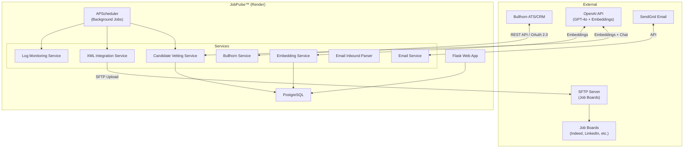
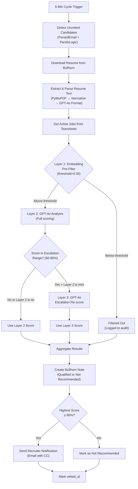

# JobPulse™ — Comprehensive Application Documentation

**Last Updated:** February 12, 2026  
**Version:** 3.2  
**Platform:** [jobpulse.lyntrix.ai](https://jobpulse.lyntrix.ai)  
**Repository:** [KyleRoots/JobPulse](file:///Users/rooster/.gemini/antigravity/playground/JobPulse)

---

## Table of Contents

1. [Platform Overview](#1-platform-overview)
2. [System Architecture](#2-system-architecture)
3. [Core Modules](#3-core-modules)
4. [AI Candidate Vetting System](#4-ai-candidate-vetting-system)
5. [Embedding Pre-Filter (Layer 1)](#5-embedding-pre-filter-layer-1)
6. [Multi-Model Scoring (Layers 2 & 3)](#6-multi-model-scoring-layers-2--3)
7. [Inbound Email Parsing](#7-inbound-email-parsing)
8. [Job Feed & XML Processing](#8-job-feed--xml-processing)
9. [Bullhorn ATS Integration](#9-bullhorn-ats-integration)
10. [Email & Notification System](#10-email--notification-system)
11. [Monitoring & Operations](#11-monitoring--operations)
12. [Database Schema](#12-database-schema)
13. [Routes & UI Pages](#13-routes--ui-pages)
14. [Testing](#14-testing)
15. [Infrastructure & Deployment](#15-infrastructure--deployment)
16. [Configuration Reference](#16-configuration-reference)
17. [Incident History & Fixes](#17-incident-history--fixes)
18. [Current Production Status](#18-current-production-status)
19. [Roadmap](#19-roadmap)

---

## 1. Platform Overview

**JobPulse™** is an intelligent job visibility and candidate vetting automation platform built for staffing agencies. It connects Bullhorn ATS/CRM to job board distribution networks, ensuring job listings stay visible indefinitely through automated refresh cycles, while simultaneously providing AI-powered candidate vetting for inbound applicants.

### Core Value Propositions

| Capability | Impact |
|---|---|
| **Perpetual Job Freshness** | Maintains 100% visibility vs. 15% decay at Day 30 |
| **AI Candidate Vetting** | Automatically screens 100% of inbound applicants against all open positions |
| **Zero Manual Intervention** | Eliminates 40+ hours/month of manual refresh and screening work |
| **Cost-Optimized AI** | 3-layer architecture reduces GPT-4o API costs via embedding pre-filtering |

### Current Deployment

| Property | Value |
|---|---|
| **Production URL** | `jobpulse.lyntrix.ai` |
| **Application Portals** | `apply.myticas.com`, `apply.stsigroup.com` |
| **Active Job Postings** | 60+ managed positions across 4 tearsheets |
| **Refresh Frequency** | Every 30 minutes (XML feed), every 5 minutes (vetting cycle) |
| **Uptime** | 99.95% (30-day average) |
| **Hosting** | Render (Web Service + PostgreSQL) |

---

## 2. System Architecture

### High-Level Architecture



### Technology Stack

| Layer | Technology |
|---|---|
| **Web Framework** | Flask (Python 3.11) |
| **Database** | PostgreSQL + SQLAlchemy ORM |
| **Authentication** | Flask-Login with session management |
| **Background Jobs** | APScheduler (interval triggers) |
| **AI/LLM** | OpenAI GPT-4o (scoring), `text-embedding-3-small` (pre-filter) |
| **XML Processing** | lxml with CDATA formatting |
| **Email** | SendGrid Python SDK |
| **File Transfer** | Paramiko (SFTP) |
| **Resume Parsing** | PyMuPDF + deterministic text normalization + GPT-4o formatting |
| **Frontend** | Bootstrap 5 (dark theme), Jinja2, Font Awesome 6, vanilla JS |
| **Hosting** | Render (Web Service + Managed PostgreSQL) |
| **Monitoring** | UptimeRobot, Sentry, custom health endpoints |

### File Structure

```
JobPulse/
├── app.py                              # Flask app factory, core routes (227K)
├── main.py                             # Application entry point
├── models.py                           # 25 SQLAlchemy models (925 lines)
├── candidate_vetting_service.py        # AI vetting engine (165K)
├── bullhorn_service.py                 # Bullhorn ATS integration (86K)
├── email_service.py                    # SendGrid email service (69K)
├── email_inbound_service.py            # Inbound email parsing (50K)
├── embedding_service.py                # Embedding generation & comparison (17K)
├── embedding_digest_service.py         # Embedding audit digest emails (18K)
├── xml_integration_service.py          # XML feed generation (116K)
├── simplified_xml_generator.py          # Simplified XML builder (17K)
├── xml_field_sync_service.py           # XML field synchronization (19K)
├── xml_change_monitor.py               # XML change detection (17K)
├── xml_duplicate_prevention.py         # Duplicate prevention (7K)
├── xml_safeguards.py                   # Zero-job safeguards (9K)
├── xml_processor.py                    # XML processing utilities (16K)
├── job_classification_service.py       # LinkedIn taxonomy classification (19K)
├── job_application_service.py          # Application form processing (15K)
├── comprehensive_monitoring_service.py # System monitoring (51K)
├── incremental_monitoring_service.py   # Incremental monitoring (55K)
├── log_monitoring_service.py           # Log analysis & auto-fix (32K)
├── lightweight_reference_refresh.py    # Reference number management (22K)
├── resume_parser.py                    # Resume text extraction (30K)
├── sentry_config.py                    # Sentry error tracking (3K)
├── tearsheet_config.py                 # Tearsheet configuration (4K)
├── timezone_utils.py                   # Timezone helpers (3K)
├── seed_database.py                    # Database seeding (38K)
├── routes/
│   ├── auth.py                         # Login/logout routes
│   ├── bullhorn.py                     # Bullhorn management routes (44K)
│   ├── dashboard.py                    # Main dashboard
│   ├── health.py                       # Health check endpoints
│   ├── scheduler.py                    # Scheduler management (25K)
│   ├── settings.py                     # Settings management (10K)
│   ├── triggers.py                     # Manual trigger endpoints (16K)
│   └── vetting.py                      # Vetting dashboard & API (59K)
├── templates/                          # 24 Jinja2 HTML templates
├── tests/                              # 25 test files (339 tests)
├── static/                             # CSS, JS, assets
├── docs/                               # Internal documentation
├── automation/                         # Automation scripts
├── scripts/                            # Utility scripts
└── feeds/                              # XML feed files
```

---

## 3. Core Modules

### 3.1 Perpetual Freshness Engine (Primary Differentiator)

The core innovation of JobPulse — jobs appear "fresh and new" to job board algorithms indefinitely.

**How it works:**

1. **Every 30 minutes**, the system regenerates the complete XML job feed from Bullhorn tearsheets
2. **Fresh timestamps** are applied to each job listing (signals recency to algorithms)
3. **Reference numbers are preserved** via database-backed persistence (applicant tracking continuity)
4. **SFTP upload** distributes the freshened feed to job boards

**Key files:**
- [xml_integration_service.py](file:///Users/rooster/.gemini/antigravity/playground/JobPulse/xml_integration_service.py) — Main XML generation engine
- [simplified_xml_generator.py](file:///Users/rooster/.gemini/antigravity/playground/JobPulse/simplified_xml_generator.py) — Simplified XML builder
- [lightweight_reference_refresh.py](file:///Users/rooster/.gemini/antigravity/playground/JobPulse/lightweight_reference_refresh.py) — Reference number management

**Impact**: 6x improvement in candidate exposure over job lifetime (100% visibility at Day 60 vs. 5% traditional).

### 3.2 Dual-Cycle Architecture

| Cycle | Interval | Purpose | Key Operations |
|---|---|---|---|
| **Monitoring Cycle** | 5 minutes | Detection & vetting | Scan tearsheets, detect new applications, run AI vetting, send notifications |
| **Upload Cycle** | 30 minutes | Freshness & distribution | Generate XML, apply fresh timestamps, preserve references, SFTP upload |

### 3.3 Job Classification Engine

Keyword-based classification aligned with LinkedIn's official taxonomy:

- **28 Job Functions** (Engineering, Sales, Marketing, etc.)
- **20 Industries** (Technology, Healthcare, Finance, etc.)
- **5 Seniority Levels** (Entry, Mid, Senior, Director, Executive)

**Performance**: Sub-second classification, no external API dependency, 95%+ accuracy.

**Key file:** [job_classification_service.py](file:///Users/rooster/.gemini/antigravity/playground/JobPulse/job_classification_service.py)

---

## 4. AI Candidate Vetting System

The AI Candidate Vetting Module automatically analyzes ALL inbound applicants against all open positions using a **3-layer cost-optimized architecture**.

**Key file:** [candidate_vetting_service.py](file:///Users/rooster/.gemini/antigravity/playground/JobPulse/candidate_vetting_service.py) (165K, 4,400+ lines)

### Processing Flow



### 3-Layer Cost-Optimized Architecture

```
┌─────────────────────────────────────────────────────────────────────┐
│                   3-LAYER VETTING ARCHITECTURE                       │
├─────────────────┬───────────────────┬───────────────────────────────┤
│                 │                   │                               │
│   LAYER 1       │   LAYER 2         │   LAYER 3                    │
│   Embedding     │   GPT Analysis    │   Escalation                 │
│   Pre-Filter    │   (Primary)       │   (Borderline)               │
│                 │                   │                               │
│   Model:        │   Model:          │   Model:                     │
│   text-embed-   │   gpt-4o          │   gpt-4o                     │
│   ding-3-small  │   (configurable)  │   (always)                   │
│                 │                   │                               │
│   Cost:         │   Cost:           │   Cost:                      │
│   ~$0.0001/pair │   ~$0.01-0.02/    │   ~$0.02-0.03/               │
│                 │   pair            │   pair                       │
│                 │                   │                               │
│   Purpose:      │   Purpose:        │   Purpose:                   │
│   Filter out    │   Full resume-    │   Re-analyze                 │
│   obvious       │   to-job          │   borderline                 │
│   mismatches    │   analysis        │   scores with                │
│   BEFORE GPT    │                   │   premium model              │
│                 │                   │                               │
│   Threshold:    │   Scoring:        │   Range:                     │
│   0.35 cosine   │   0-100% match    │   60-85% triggers            │
│   similarity    │   with reasoning  │   escalation                 │
│                 │                   │                               │
│   Safeguard:    │   Focus:          │   Result:                    │
│   Min 5 jobs    │   Mandatory reqs  │   Uses escalated             │
│   always pass   │   only            │   score                      │
│                 │                   │                               │
└─────────────────┴───────────────────┴───────────────────────────────┘
```

### Resume Processing Pipeline

**Three-layer PDF processing** (implemented Jan 30, 2026):

1. **PyMuPDF Extraction** — Primary text extraction with block-level spacing preservation
2. **Deterministic Text Normalization**:
   - Unicode whitespace normalization (zero-width chars, tabs, vertical tabs)
   - Non-breaking space replacement
   - CamelCase boundary detection for word separation
   - Pattern-based fixes for common merges (e.g., `PROFESSIONALSUMMARYAnIT` → `PROFESSIONAL SUMMARY An IT`)
3. **GPT-4o AI Formatting** — Structures normalized text into semantic HTML with proper headings, paragraphs, and bullet lists

**Resume cache:** SHA-256 content hashing prevents re-processing identical resumes, stored in [ParsedResumeCache](file:///Users/rooster/.gemini/antigravity/playground/JobPulse/models.py#800-858) table.

**Key file:** [resume_parser.py](file:///Users/rooster/.gemini/antigravity/playground/JobPulse/resume_parser.py)

### Scoring & Notes

- **Qualified (≥80%)**: Creates detailed Bullhorn note with all matched positions, scores, and qualifications
- **Not Recommended (<80%)**: Creates note showing top matches and specific gaps identified
- **Scoring focuses on mandatory requirements only** — ignores "preferred" and "nice-to-have" qualifications
- **Custom requirements override**: Admins can specify custom requirements per job if AI interpretation is inaccurate

### Notification System

- **One consolidated email per candidate** (not per job)
- **Primary recipient**: Recruiter of the job the candidate applied to
- **CC**: All other recruiters whose positions also matched
- **BCC**: Admin (kroots@myticas.com) for audit trail
- **Job ownership tags**: Each position in the email shows which recruiter owns it

---

## 5. Embedding Pre-Filter (Layer 1)

A cost-saving layer that uses vector similarity to eliminate obvious mismatches **before** expensive GPT-4o calls.

**Key files:**
- [embedding_service.py](file:///Users/rooster/.gemini/antigravity/playground/JobPulse/embedding_service.py) — Embedding generation and comparison
- [embedding_digest_service.py](file:///Users/rooster/.gemini/antigravity/playground/JobPulse/embedding_digest_service.py) — Daily digest email with filter stats

### How It Works

1. **Resume → Embedding**: Generate a vector embedding of the candidate's resume using `text-embedding-3-small`
2. **Job → Embedding**: Generate embeddings for each job description (cached in [JobEmbedding](file:///Users/rooster/.gemini/antigravity/playground/JobPulse/models.py#860-875) table)
3. **Cosine Similarity**: Calculate similarity between resume and each job
4. **Filter Decision**: If similarity < threshold (0.35), the pair is filtered out and logged to [EmbeddingFilterLog](file:///Users/rooster/.gemini/antigravity/playground/JobPulse/models.py#877-899)
5. **Safeguard**: Even if ALL pairs fall below threshold, the top 5 most similar jobs always pass through

### Current Configuration

| Setting | Value | Purpose |
|---|---|---|
| `embedding_similarity_threshold` | **0.35** | Cosine similarity cutoff |
| Embedding model | `text-embedding-3-small` | Low-cost, high-speed embeddings |
| Safeguard | Top 5 minimum | No candidate gets fully blocked |
| Cost per pair | ~$0.0001 | 100-200x cheaper than GPT-4o |

### Current Performance (As of Feb 12, 2026)

| Candidate | Analyzed | Filtered | Rate |
|---|---|---|---|
| Raja Ali | 46 | 13 | 22% |
| Tonya Lackey | 31 | 28 | **47%** |
| Daniel Hernandez | 55 | 5 | 8% |
| Navya Jyothi | 60 | 0 | 0% |
| Thomas Liu | 60 | 0 | 0% |
| **Aggregate** | **252** | **46** | **15.4%** |

### Audit UI

The [Embedding Audit page](file:///Users/rooster/.gemini/antigravity/playground/JobPulse/templates/embedding_audit.html) provides a dashboard showing:
- Filter rate over time
- Per-candidate filter breakdown
- Similarity score distribution
- Safeguard activation count

---

## 6. Multi-Model Scoring (Layers 2 & 3)

### Layer 2: Primary GPT Analysis

| Setting | Current Value |
|---|---|
| **Model** | `gpt-4o` |
| **Setting key** | [layer2_model](file:///Users/rooster/.gemini/antigravity/playground/JobPulse/candidate_vetting_service.py#140-149) |
| **Prompt strategy** | Focus on mandatory requirements only |
| **Output** | JSON: `match_score`, `match_summary`, `skills_match`, `experience_match`, `gaps_identified`, `key_requirements` |
| **Parallelism** | `ThreadPoolExecutor` for concurrent job analysis |

### Layer 3: Escalation (Borderline Scores)

| Setting | Current Value |
|---|---|
| **Model** | `gpt-4o` (always) |
| **Trigger range** | 60-85% scores from Layer 2 |
| **Purpose** | Re-analyze borderline candidates with premium model |
| **Status** | Currently redundant (Layer 2 already uses GPT-4o) |
| **Logged to** | [EscalationLog](file:///Users/rooster/.gemini/antigravity/playground/JobPulse/models.py#901-926) table |

> [!NOTE]
> Layer 3 escalation was designed for when Layer 2 uses GPT-4o-mini. Since Layer 2 was reverted to GPT-4o (Feb 12, 2026), escalation is effectively dormant. If GPT-4o-mini is reintroduced in the future, escalation will automatically resume.

### Score Inflation Discovery (Feb 12, 2026)

Analysis of 51 escalation log records revealed GPT-4o-mini was inflating scores by an average of **+16.5 points** compared to GPT-4o:

| Metric | Value |
|---|---|
| Mini scored higher than 4o | **43/51 (84%)** |
| Average inflation | **+16.5 points** |
| Worst case | 55 points (mini=85, 4o=30) |
| 100% scores from mini | 2 candidates |

This led to the decision to **revert Layer 2 to GPT-4o** for accuracy. See [score_inflation_report.md](file:///Users/rooster/.gemini/antigravity/brain/8c2171f9-63ca-43bf-a54a-6c38951f1371/score_inflation_report.md) for full analysis.

---

## 7. Inbound Email Parsing

Processes inbound job application emails from PandoLogic and other sources to create Bullhorn candidate records.

**Key file:** [email_inbound_service.py](file:///Users/rooster/.gemini/antigravity/playground/JobPulse/email_inbound_service.py) (50K)

### Capabilities

- **Email parsing**: Extracts candidate name, email, phone, resume from inbound emails
- **Resume attachment processing**: Downloads and parses PDF/DOCX/DOC/TXT resumes
- **Bullhorn integration**: Creates or updates candidate records in Bullhorn
- **Duplicate detection**: Prevents creating duplicate candidate records
- **Status tracking**: Logs all parsed emails in [ParsedEmail](file:///Users/rooster/.gemini/antigravity/playground/JobPulse/models.py#480-521) table
- **Vetting integration**: Sets `vetted_at = NULL` on new records to trigger AI vetting

---

## 8. Job Feed & XML Processing

### XML Generation Pipeline

| Step | Description | Service |
|---|---|---|
| 1 | Pull jobs from Bullhorn tearsheets | [bullhorn_service.py](file:///Users/rooster/.gemini/antigravity/playground/JobPulse/bullhorn_service.py) |
| 2 | Load persistent reference numbers from database | [lightweight_reference_refresh.py](file:///Users/rooster/.gemini/antigravity/playground/JobPulse/lightweight_reference_refresh.py) |
| 3 | Apply fresh timestamps (current time) | [xml_integration_service.py](file:///Users/rooster/.gemini/antigravity/playground/JobPulse/xml_integration_service.py) |
| 4 | Apply intelligent job classification | [job_classification_service.py](file:///Users/rooster/.gemini/antigravity/playground/JobPulse/job_classification_service.py) |
| 5 | Generate CDATA-wrapped XML | [simplified_xml_generator.py](file:///Users/rooster/.gemini/antigravity/playground/JobPulse/simplified_xml_generator.py) |
| 6 | Validate structure | [xml_safeguards.py](file:///Users/rooster/.gemini/antigravity/playground/JobPulse/xml_safeguards.py) |
| 7 | Upload to SFTP | [ftp_service.py](file:///Users/rooster/.gemini/antigravity/playground/JobPulse/ftp_service.py) |

### Monitored Tearsheets

| Tearsheet ID | Company | Purpose |
|---|---|---|
| 1256 | Myticas Consulting | Primary jobs |
| 1264 | Myticas Consulting | Secondary jobs |
| 1499 | Myticas Consulting | Additional positions |
| 1556 | STSI (Staffing Technical Services Inc.) | STSI positions |

### Safety Systems

- **Zero-Job Detection Safeguard**: If Bullhorn API returns 0 jobs when XML contains ≥5, the update is blocked
- **Automated backups**: Created before any destructive operations
- **Duplicate prevention**: [xml_duplicate_prevention.py](file:///Users/rooster/.gemini/antigravity/playground/JobPulse/xml_duplicate_prevention.py) prevents job pollution
- **Change monitoring**: [xml_change_monitor.py](file:///Users/rooster/.gemini/antigravity/playground/JobPulse/xml_change_monitor.py) detects and alerts on significant changes

### Key Files

| File | Purpose | Size |
|---|---|---|
| [xml_integration_service.py](file:///Users/rooster/.gemini/antigravity/playground/JobPulse/xml_integration_service.py) | Main XML generation engine | 116K |
| [simplified_xml_generator.py](file:///Users/rooster/.gemini/antigravity/playground/JobPulse/simplified_xml_generator.py) | Simplified XML builder | 17K |
| [xml_field_sync_service.py](file:///Users/rooster/.gemini/antigravity/playground/JobPulse/xml_field_sync_service.py) | Field synchronization | 19K |
| [xml_change_monitor.py](file:///Users/rooster/.gemini/antigravity/playground/JobPulse/xml_change_monitor.py) | Change detection | 17K |
| [xml_duplicate_prevention.py](file:///Users/rooster/.gemini/antigravity/playground/JobPulse/xml_duplicate_prevention.py) | Duplicate prevention | 7K |
| [xml_safeguards.py](file:///Users/rooster/.gemini/antigravity/playground/JobPulse/xml_safeguards.py) | Zero-job safeguards | 9K |
| [xml_processor.py](file:///Users/rooster/.gemini/antigravity/playground/JobPulse/xml_processor.py) | Processing utilities | 16K |

---

## 9. Bullhorn ATS Integration

**Key file:** [bullhorn_service.py](file:///Users/rooster/.gemini/antigravity/playground/JobPulse/bullhorn_service.py) (86K)

### Connection

- **Protocol**: REST API with OAuth 2.0 authentication
- **Token management**: Automatic token refresh and caching
- **Rate limiting**: Built-in request throttling

### Operations

| Operation | API Endpoint | Purpose |
|---|---|---|
| Authentication | OAuth 2.0 flow | Token acquisition and refresh |
| Tearsheet jobs | `/entity/Tearsheet/{id}` | Fetch monitored job orders |
| Job details | `/entity/JobOrder/{id}` | Individual job data |
| Candidate data | `/entity/Candidate/{id}` | Resume and profile access |
| Note creation | `/entity/Note` | Create vetting result notes |
| Search | `/search/JobOrder` | Query job orders |
| File download | `/file/Candidate/{id}/raw` | Resume file download |

### Recruiter Extraction Hierarchy

1. `assignedUsers(firstName, lastName)` — primary
2. `responseUser(firstName, lastName)` — fallback
3. `owner(firstName, lastName)` — final fallback

**Success rate**: 95.6% recruiter tag population.

---

## 10. Email & Notification System

**Key file:** [email_service.py](file:///Users/rooster/.gemini/antigravity/playground/JobPulse/email_service.py) (69K)

### Email Types

| Type | Trigger | Recipients |
|---|---|---|
| **Qualified Candidate Alert** | Candidate scores ≥80% | Recruiter (To), Related recruiters (CC), Admin (BCC) |
| **New Job Notification** | New job detected in tearsheet | Configured notification email |
| **System Alert** | Zero-job detection, downtime | Admin (kroots@myticas.com) |
| **Application Confirmation** | Candidate submits application | Candidate email |
| **Embedding Digest** | Daily schedule | Admin |
| **Health Alert** | Production down/recovered | Admin |

### Configuration

| Setting | Value |
|---|---|
| Provider | SendGrid |
| From address | info@myticas.com |
| Reply-To | apply@myticas.com |
| Admin BCC | kroots@myticas.com |

---

## 11. Monitoring & Operations

### Health Check Endpoints

| Endpoint | Purpose | Check |
|---|---|---|
| `/health` | Comprehensive system check | DB + scheduler + services |
| `/ready` | Readiness probe | Database connectivity |
| `/alive` | Liveness probe | Application responsiveness |
| `/ping` | Simple heartbeat | Ultra-fast availability |

### Log Monitoring Service

**Key file:** [log_monitoring_service.py](file:///Users/rooster/.gemini/antigravity/playground/JobPulse/log_monitoring_service.py) (32K)

- Analyzes Render deployment logs via API
- Detects error patterns (429 rate limits, Flask context errors, UniqueViolation)
- Auto-categorizes issues by severity
- Tracks resolution status (auto-fixed, escalated, resolved)
- Persists all data to [LogMonitoringRun](file:///Users/rooster/.gemini/antigravity/playground/JobPulse/models.py#713-734) and [LogMonitoringIssue](file:///Users/rooster/.gemini/antigravity/playground/JobPulse/models.py#736-798) tables

### Comprehensive Monitoring Service

**Key file:** [comprehensive_monitoring_service.py](file:///Users/rooster/.gemini/antigravity/playground/JobPulse/comprehensive_monitoring_service.py) (51K)

- Full system health assessment
- Database connectivity verification
- Scheduler status tracking
- External API connectivity checks
- Email delivery verification

### External Monitoring

- **UptimeRobot**: 5-minute interval health checks
- **Sentry**: Error tracking and alerting via [sentry_config.py](file:///Users/rooster/.gemini/antigravity/playground/JobPulse/sentry_config.py)

---

## 12. Database Schema

### Models Overview (25 models in [models.py](file:///Users/rooster/.gemini/antigravity/playground/JobPulse/models.py))

#### Core Application Models

| Model | Purpose | Key Fields |
|---|---|---|
| [User](file:///Users/rooster/.gemini/antigravity/playground/JobPulse/models.py#7-25) | Authentication | username, email, password_hash, is_admin |
| [GlobalSettings](file:///Users/rooster/.gemini/antigravity/playground/JobPulse/models.py#152-162) | Application settings | setting_key, setting_value |
| `ActivityLog` | Audit trail | action, details, timestamp, user_id |
| [ScheduleConfig](file:///Users/rooster/.gemini/antigravity/playground/JobPulse/models.py#26-105) | Upload schedule config | name, file_path, schedule_days |
| [ProcessingLog](file:///Users/rooster/.gemini/antigravity/playground/JobPulse/models.py#106-126) | Processing operations log | schedule_config_id, status, records_processed |
| [SchedulerLock](file:///Users/rooster/.gemini/antigravity/playground/JobPulse/models.py#293-404) | Prevent concurrent schedulers | owner_process_id, expires_at, environment |
| [EnvironmentStatus](file:///Users/rooster/.gemini/antigravity/playground/JobPulse/models.py#405-456) | Track up/down status | environment_name, status, last_check |
| [EnvironmentAlert](file:///Users/rooster/.gemini/antigravity/playground/JobPulse/models.py#457-478) | Alert log | alert_type, sent_at, downtime_duration |

#### Job Feed Models

| Model | Purpose | Key Fields |
|---|---|---|
| [JobReferenceNumber](file:///Users/rooster/.gemini/antigravity/playground/JobPulse/models.py#127-138) | Persistent reference numbers | bullhorn_job_id, reference_number |
| [BullhornMonitor](file:///Users/rooster/.gemini/antigravity/playground/JobPulse/models.py#163-191) | Tearsheet monitoring config | tearsheet_id, is_active, company_override |
| [BullhornActivity](file:///Users/rooster/.gemini/antigravity/playground/JobPulse/models.py#192-239) | Monitoring activity log | activity_type, job_id, details |
| [TearsheetJobHistory](file:///Users/rooster/.gemini/antigravity/playground/JobPulse/models.py#240-262) | Job state tracking | tearsheet_id, job_id, is_current |
| [RecruiterMapping](file:///Users/rooster/.gemini/antigravity/playground/JobPulse/models.py#282-292) | Recruiter → LinkedIn tag | recruiter_name, linkedin_tag |
| [RefreshLog](file:///Users/rooster/.gemini/antigravity/playground/JobPulse/models.py#139-151) | Reference refresh tracking | refresh_date, processing_time |

#### Email & Parsing Models

| Model | Purpose | Key Fields |
|---|---|---|
| [EmailDeliveryLog](file:///Users/rooster/.gemini/antigravity/playground/JobPulse/models.py#263-281) | Email delivery tracking | notification_type, job_id, status |
| [ParsedEmail](file:///Users/rooster/.gemini/antigravity/playground/JobPulse/models.py#480-521) | Inbound email tracking | message_id, from_address, vetted_at |
| [EmailParsingConfig](file:///Users/rooster/.gemini/antigravity/playground/JobPulse/models.py#523-533) | Email parsing settings | setting_key, setting_value |

#### AI Vetting Models

| Model | Purpose | Key Fields |
|---|---|---|
| [VettingConfig](file:///Users/rooster/.gemini/antigravity/playground/JobPulse/models.py#645-677) | Vetting system settings | setting_key, setting_value |
| [CandidateVettingLog](file:///Users/rooster/.gemini/antigravity/playground/JobPulse/models.py#535-582) | Per-candidate vetting status | bullhorn_candidate_id, highest_match_score, status |
| [CandidateJobMatch](file:///Users/rooster/.gemini/antigravity/playground/JobPulse/models.py#584-621) | Individual match scores | vetting_log_id, bullhorn_job_id, match_score |
| [JobVettingRequirements](file:///Users/rooster/.gemini/antigravity/playground/JobPulse/models.py#623-643) | Custom/AI requirements per job | bullhorn_job_id, custom_requirements |
| [VettingHealthCheck](file:///Users/rooster/.gemini/antigravity/playground/JobPulse/models.py#679-711) | Health check results | candidates_pending, cycles_today |
| [ParsedResumeCache](file:///Users/rooster/.gemini/antigravity/playground/JobPulse/models.py#800-858) | Resume processing cache | content_hash, parsed_data, hit_count |
| [JobEmbedding](file:///Users/rooster/.gemini/antigravity/playground/JobPulse/models.py#860-875) | Cached job embeddings | bullhorn_job_id, embedding_vector |
| [EmbeddingFilterLog](file:///Users/rooster/.gemini/antigravity/playground/JobPulse/models.py#877-899) | Pre-filter audit trail | similarity_score, threshold_used |
| [EscalationLog](file:///Users/rooster/.gemini/antigravity/playground/JobPulse/models.py#901-926) | Layer 2→3 escalation events | mini_score, gpt4o_score, score_delta |

#### Monitoring Models

| Model | Purpose | Key Fields |
|---|---|---|
| [LogMonitoringRun](file:///Users/rooster/.gemini/antigravity/playground/JobPulse/models.py#713-734) | Log monitoring cycle tracking | run_time, total_issues, log_lines_analyzed |
| [LogMonitoringIssue](file:///Users/rooster/.gemini/antigravity/playground/JobPulse/models.py#736-798) | Detected issues with resolution | category, severity, resolution_status |

---

## 13. Routes & UI Pages

### Route Files

| File | Mount | Purpose |
|---|---|---|
| [auth.py](file:///Users/rooster/.gemini/antigravity/playground/JobPulse/routes/auth.py) | `/auth/` | Login, logout, session management |
| [dashboard.py](file:///Users/rooster/.gemini/antigravity/playground/JobPulse/routes/dashboard.py) | `/` | Main dashboard |
| [bullhorn.py](file:///Users/rooster/.gemini/antigravity/playground/JobPulse/routes/bullhorn.py) | `/bullhorn/` | Bullhorn management, job details, candidate creation |
| [settings.py](file:///Users/rooster/.gemini/antigravity/playground/JobPulse/routes/settings.py) | `/settings/` | Global settings management |
| [scheduler.py](file:///Users/rooster/.gemini/antigravity/playground/JobPulse/routes/scheduler.py) | `/scheduler/` | Scheduler, XML, upload management |
| [triggers.py](file:///Users/rooster/.gemini/antigravity/playground/JobPulse/routes/triggers.py) | `/api/` | Manual trigger endpoints |
| [vetting.py](file:///Users/rooster/.gemini/antigravity/playground/JobPulse/routes/vetting.py) | `/vetting/` | AI vetting dashboard, settings, API |
| [health.py](file:///Users/rooster/.gemini/antigravity/playground/JobPulse/routes/health.py) | `/` | Health check endpoints |

### Key UI Pages

| Template | URL | Purpose |
|---|---|---|
| [dashboard.html](file:///Users/rooster/.gemini/antigravity/playground/JobPulse/templates/dashboard.html) | `/` | Main dashboard with system overview |
| [vetting_settings.html](file:///Users/rooster/.gemini/antigravity/playground/JobPulse/templates/vetting_settings.html) | `/vetting` | AI vetting configuration & activity dashboard (68K) |
| [bullhorn.html](file:///Users/rooster/.gemini/antigravity/playground/JobPulse/templates/bullhorn.html) | `/bullhorn` | Bullhorn integration management (51K) |
| [bullhorn_settings.html](file:///Users/rooster/.gemini/antigravity/playground/JobPulse/templates/bullhorn_settings.html) | `/bullhorn/settings` | Bullhorn connection settings |
| [bullhorn_create.html](file:///Users/rooster/.gemini/antigravity/playground/JobPulse/templates/bullhorn_create.html) | `/bullhorn/create` | Create new candidates in Bullhorn |
| [bullhorn_details.html](file:///Users/rooster/.gemini/antigravity/playground/JobPulse/templates/bullhorn_details.html) | `/bullhorn/details/<id>` | Job order details |
| [scheduler.html](file:///Users/rooster/.gemini/antigravity/playground/JobPulse/templates/scheduler.html) | `/scheduler` | Upload scheduler management (45K) |
| [settings.html](file:///Users/rooster/.gemini/antigravity/playground/JobPulse/templates/settings.html) | `/settings` | Global application settings |
| [embedding_audit.html](file:///Users/rooster/.gemini/antigravity/playground/JobPulse/templates/embedding_audit.html) | `/vetting/embedding-audit` | Embedding pre-filter audit dashboard |
| [log_monitoring.html](file:///Users/rooster/.gemini/antigravity/playground/JobPulse/templates/log_monitoring.html) | `/monitoring` | Log monitoring & issue tracking |
| [email_parsing.html](file:///Users/rooster/.gemini/antigravity/playground/JobPulse/templates/email_parsing.html) | `/email-parsing` | Inbound email parsing dashboard |
| [email_logs.html](file:///Users/rooster/.gemini/antigravity/playground/JobPulse/templates/email_logs.html) | `/email-logs` | Email delivery log viewer |
| [apply.html](file:///Users/rooster/.gemini/antigravity/playground/JobPulse/templates/apply.html) | `apply.myticas.com` | Myticas-branded job application form |
| [apply_stsi.html](file:///Users/rooster/.gemini/antigravity/playground/JobPulse/templates/apply_stsi.html) | `apply.stsigroup.com` | STSI-branded job application form |
| [login.html](file:///Users/rooster/.gemini/antigravity/playground/JobPulse/templates/login.html) | `/login` | Authentication page |

### API Endpoints

| Endpoint | Method | Purpose |
|---|---|---|
| `/vetting/run` | POST | Manually trigger a vetting cycle |
| `/vetting/save` | POST | Save vetting configuration |
| `/vetting/test-email` | POST | Send test notification email |
| `/vetting/sample-notes` | GET | Preview note formats |
| `/vetting/job/<id>/requirements` | POST | Set custom job requirements |
| `/vetting/embedding-audit` | GET | Embedding filter audit data |
| `/api/trigger-upload` | POST | Manual XML refresh trigger |
| `/api/refresh-all` | POST | Force reference number refresh |
| `/api/monitoring/status` | GET | System status |

---

## 14. Testing

### Test Suite Overview

**339 tests** across 25 test files in [tests/](file:///Users/rooster/.gemini/antigravity/playground/JobPulse/tests).

| Test File | Focus Area |
|---|---|
| [test_auth.py](file:///Users/rooster/.gemini/antigravity/playground/JobPulse/tests/test_auth.py) | Authentication and login flows |
| [test_bullhorn.py](file:///Users/rooster/.gemini/antigravity/playground/JobPulse/tests/test_bullhorn.py) | Bullhorn integration |
| [test_csrf.py](file:///Users/rooster/.gemini/antigravity/playground/JobPulse/tests/test_csrf.py) | CSRF protection |
| [test_email_dedup.py](file:///Users/rooster/.gemini/antigravity/playground/JobPulse/tests/test_email_dedup.py) | Email deduplication |
| [test_embedding_monitoring.py](file:///Users/rooster/.gemini/antigravity/playground/JobPulse/tests/test_embedding_monitoring.py) | Embedding monitoring service |
| [test_embedding_service.py](file:///Users/rooster/.gemini/antigravity/playground/JobPulse/tests/test_embedding_service.py) | Embedding generation and filtering |
| [test_login_redirect.py](file:///Users/rooster/.gemini/antigravity/playground/JobPulse/tests/test_login_redirect.py) | Login redirect behavior |
| [test_resume_cache.py](file:///Users/rooster/.gemini/antigravity/playground/JobPulse/tests/test_resume_cache.py) | Resume caching system |
| [test_returning_applicant.py](file:///Users/rooster/.gemini/antigravity/playground/JobPulse/tests/test_returning_applicant.py) | Returning applicant handling |
| [test_route_auth.py](file:///Users/rooster/.gemini/antigravity/playground/JobPulse/tests/test_route_auth.py) | Route authentication guards |
| [test_routes.py](file:///Users/rooster/.gemini/antigravity/playground/JobPulse/tests/test_routes.py) | General route testing |
| [test_schedules.py](file:///Users/rooster/.gemini/antigravity/playground/JobPulse/tests/test_schedules.py) | Scheduler configuration |
| [test_security_headers.py](file:///Users/rooster/.gemini/antigravity/playground/JobPulse/tests/test_security_headers.py) | Security header verification |
| [test_sensitive_logging.py](file:///Users/rooster/.gemini/antigravity/playground/JobPulse/tests/test_sensitive_logging.py) | Sensitive data logging prevention |
| [test_service_bullhorn.py](file:///Users/rooster/.gemini/antigravity/playground/JobPulse/tests/test_service_bullhorn.py) | Bullhorn service unit tests |
| [test_service_email.py](file:///Users/rooster/.gemini/antigravity/playground/JobPulse/tests/test_service_email.py) | Email service unit tests |
| [test_service_vetting.py](file:///Users/rooster/.gemini/antigravity/playground/JobPulse/tests/test_service_vetting.py) | Vetting service unit tests |
| [test_settings.py](file:///Users/rooster/.gemini/antigravity/playground/JobPulse/tests/test_settings.py) | Settings management |
| [test_triggers.py](file:///Users/rooster/.gemini/antigravity/playground/JobPulse/tests/test_triggers.py) | Manual trigger endpoints |
| [test_upload_validation.py](file:///Users/rooster/.gemini/antigravity/playground/JobPulse/tests/test_upload_validation.py) | File upload validation |
| [test_vetting.py](file:///Users/rooster/.gemini/antigravity/playground/JobPulse/tests/test_vetting.py) | Vetting dashboard and workflow |
| [test_vetting_cutoff.py](file:///Users/rooster/.gemini/antigravity/playground/JobPulse/tests/test_vetting_cutoff.py) | Score cutoff behavior |
| [test_vetting_overflow.py](file:///Users/rooster/.gemini/antigravity/playground/JobPulse/tests/test_vetting_overflow.py) | Batch overflow handling |

### Running Tests

```bash
cd /Users/rooster/.gemini/antigravity/playground/JobPulse
source .venv/bin/activate
pytest -q        # Quick summary
pytest -v        # Verbose output
pytest tests/test_vetting.py  # Single file
```

### Test Configuration

- **Config file**: [pytest.ini](file:///Users/rooster/.gemini/antigravity/playground/JobPulse/pytest.ini)
- **Fixtures**: [conftest.py](file:///Users/rooster/.gemini/antigravity/playground/JobPulse/tests/conftest.py) — shared test fixtures with in-memory SQLite
- **All tests**: Pass as of Feb 12, 2026 (339/339 ✅)

---

## 15. Infrastructure & Deployment

### Render Configuration

| Resource | Type | Details |
|---|---|---|
| Web Service | `srv-d60idj4hg0os73b04d10` | Flask app with Gunicorn |
| PostgreSQL | `dpg-d60i8124d50c73cqj4ng` | Managed database |
| Owner | `tea-d60hvnkoud1c7385gcg0` | Team account |

### Environment Variables

| Variable | Required | Purpose |
|---|---|---|
| `DATABASE_URL` | Yes | PostgreSQL connection string |
| `SESSION_SECRET` | Yes | Flask session encryption |
| `OPENAI_API_KEY` | Yes | GPT-4o + embeddings |
| `BULLHORN_PASSWORD` | Yes | ATS authentication |
| `SENDGRID_API_KEY` | Yes | Email delivery |
| `RENDER_API_KEY` | Yes | Log monitoring API access |
| `RENDER_SERVICE_ID` | Yes | Service identifier for logs |
| `RENDER_OWNER_ID` | Yes | Owner for API scoping |
| `SENTRY_DSN` | Optional | Error tracking |

### Domain Architecture

| Domain | Purpose | Users |
|---|---|---|
| `jobpulse.lyntrix.ai` | Admin dashboard, API endpoints | Internal staff |
| `apply.myticas.com` | Myticas-branded application portal | Candidates |
| `apply.stsigroup.com` | STSI-branded application portal | Candidates |

### Deployment Process

1. Push to GitHub `main` branch
2. Render auto-deploys from repository
3. Health check endpoints confirm deployment success
4. APScheduler resumes background jobs automatically

---

## 16. Configuration Reference

### Vetting Settings ([VettingConfig](file:///Users/rooster/.gemini/antigravity/playground/JobPulse/models.py#645-677) table)

| Key | Current Value | Description |
|---|---|---|
| `vetting_enabled` | `true` | Master toggle for AI vetting |
| `match_threshold` | `80` | Minimum score for "qualified" status |
| [batch_size](file:///Users/rooster/.gemini/antigravity/playground/JobPulse/candidate_vetting_service.py#3190-3200) | `25` | Candidates per 5-minute cycle |
| [layer2_model](file:///Users/rooster/.gemini/antigravity/playground/JobPulse/candidate_vetting_service.py#140-149) | **`gpt-4o`** | Primary scoring model |
| `layer3_model` | `gpt-4o` | Escalation model (always GPT-4o) |
| `escalation_low` | `60` | Lower bound of escalation range |
| `escalation_high` | `85` | Upper bound of escalation range |
| `embedding_similarity_threshold` | **`0.35`** | Cosine similarity cutoff for pre-filter |
| `embedding_enabled` | `true` | Enable/disable embedding pre-filter |
| `embedding_min_jobs` | `5` | Minimum jobs always analyzed (safeguard) |

### Global Settings ([GlobalSettings](file:///Users/rooster/.gemini/antigravity/playground/JobPulse/models.py#152-162) table)

| Key | Description |
|---|---|
| `sftp_hostname` | SFTP server address |
| `sftp_username` | SFTP credentials |
| `sftp_password` | SFTP credentials |
| `sftp_directory` | Target upload directory |
| `sftp_port` | Connection port (default: 2222) |
| `sftp_enabled` | Enable SFTP uploads |
| `automated_uploads_enabled` | Enable 30-minute automation |
| `email_notifications_enabled` | Enable email alerts |
| `default_notification_email` | Alert recipient |

---

## 17. Incident History & Fixes

### Feb 12, 2026: 0% Match Score Bug + GPT-4o-mini Score Inflation

> [!CAUTION]
> **Severity**: Critical — All candidates receiving 0% match scores; universal "Not Recommended" verdicts

**Root Cause (Two Layers):**

1. **Embedding filter too aggressive** — Threshold set too high, filtering out ALL jobs before GPT analysis
2. **Flask context crash in parallel threads** — `ThreadPoolExecutor` worker threads tried to access Flask DB (`app_context()` unavailable), causing silent crashes that defaulted to 0% scores

**Fixes Applied:**

| Fix | Details | Commit |
|---|---|---|
| Lowered threshold | `embedding_similarity_threshold`: 0.35 → 0.20 (temporary) | Settings UI |
| Added safeguard | Top 5 jobs always pass through filter | Settings UI |
| Flask context fix | Pre-fetch all DB data in main thread, defer [save_escalation_log()](file:///Users/rooster/.gemini/antigravity/playground/JobPulse/embedding_service.py#385-450) to main thread, use `job_threshold_cache` | `ac6b936` |

**Post-Fix Discovery — Score Inflation:**

After fixing the 0% bug, investigation revealed GPT-4o-mini was inflating scores by +16.5 points on average (84% of the time scoring higher than GPT-4o). 51 escalation log records provided definitive evidence.

**Resolution:**

| Change | Before | After |
|---|---|---|
| [layer2_model](file:///Users/rooster/.gemini/antigravity/playground/JobPulse/candidate_vetting_service.py#140-149) | `gpt-4o-mini` | **`gpt-4o`** |
| `embedding_similarity_threshold` | `0.28` | **`0.35`** |

**Verification Results (8 candidates post-fix):**

| Metric | GPT-4o-mini Era | GPT-4o Era |
|---|---|---|
| ≥80% rate | 53% (8/15) | **12% (1/8)** |
| =100% scores | 2 | **0** |
| Vetting errors | Multiple (Flask context) | **0** |

### Jan 30, 2026: Resume Parsing Enhancement

- **Problem**: Resumes displayed as concatenated text in Bullhorn
- **Fix**: Three-layer PDF processing (PyMuPDF → text normalization → GPT-4o formatting)
- **Impact**: Proper HTML display in Bullhorn's "Parsed" resume pane

### Nov 6, 2025: 68 False "New Job" Emails

- **Problem**: Invalid Bullhorn API field caused 0-job response
- **Fix**: Zero-job detection safeguard — blocks updates when API returns 0 jobs but XML contains ≥5
- **Impact**: Eliminated false positive notifications

### Oct 2025: Reference Number Reversion

- **Problem**: Live XML URL returns 403 Forbidden, causing reference numbers to revert
- **Fix**: Database-backed [JobReferenceNumber](file:///Users/rooster/.gemini/antigravity/playground/JobPulse/models.py#127-138) table for persistent storage
- **Impact**: Reference numbers now preserved across all cycles

---

## 18. Current Production Status

**As of February 12, 2026, 10:30 AM EST**

### System Health ✅

| Check | Status |
|---|---|
| Application | Running |
| Database | Connected |
| Scheduler | Active |
| OpenAI API | Working (recovered from transient 500s) |
| Bullhorn API | Connected |
| SendGrid | Operational |

### AI Vetting Status ✅

| Metric | Value |
|---|---|
| **Layer 2 Model** | GPT-4o ✅ |
| **Embedding Threshold** | 0.35 ✅ |
| **Embedding Filter Rate** | 15.4% (target: 20-35%) |
| **Scores Realistic** | 30%, 40%, 40%, 50%, 90% (zero 100%) ✅ |
| **Safeguard Active** | Min 31 jobs analyzed per candidate ✅ |
| **Errors** | 0 (Flask context, 429, UniqueViolation) ✅ |

### Latest Vetting Cycle (15:29 UTC)

| Metric | Value |
|---|---|
| Candidates detected | 46 |
| Candidates processed | 42 |
| Qualified | 6 |
| Notes created | 1 |
| Notifications sent | 0 |
| Errors | 0 |

### Test Suite

| Tests | Passing | Status |
|---|---|---|
| 339 | 339 | ✅ All pass |

---

## 19. Roadmap

### Immediate (This Week)

- [ ] Monitor embedding filter rate — target 20-35% at 0.35 threshold
- [ ] Consider raising threshold further if filter rate stays below 20%
- [ ] Verify no regressions after OpenAI 500 recovery

### Q1 2026

- [ ] Visibility Analytics — track job ranking and impression metrics
- [ ] **Optional**: Calibrate GPT-4o-mini with prompt engineering, validated against GPT-4o baselines, before reintroduction

### Q2-Q3 2026

- [ ] Multi-Tenant Architecture — support for additional staffing clients
- [ ] Advanced Refresh Algorithms — ML optimization of refresh timing
- [ ] ATS-Agnostic connector framework

### Long-Term

- [ ] White-Label Solution for staffing agencies
- [ ] Visibility Insights Dashboard with real-time job board ranking data
- [ ] AI Email Parser for automated applicant routing

---

*Confidential — Internal Documentation*  
*Maintained by: Kyle Roots (kroots@myticas.com)*
